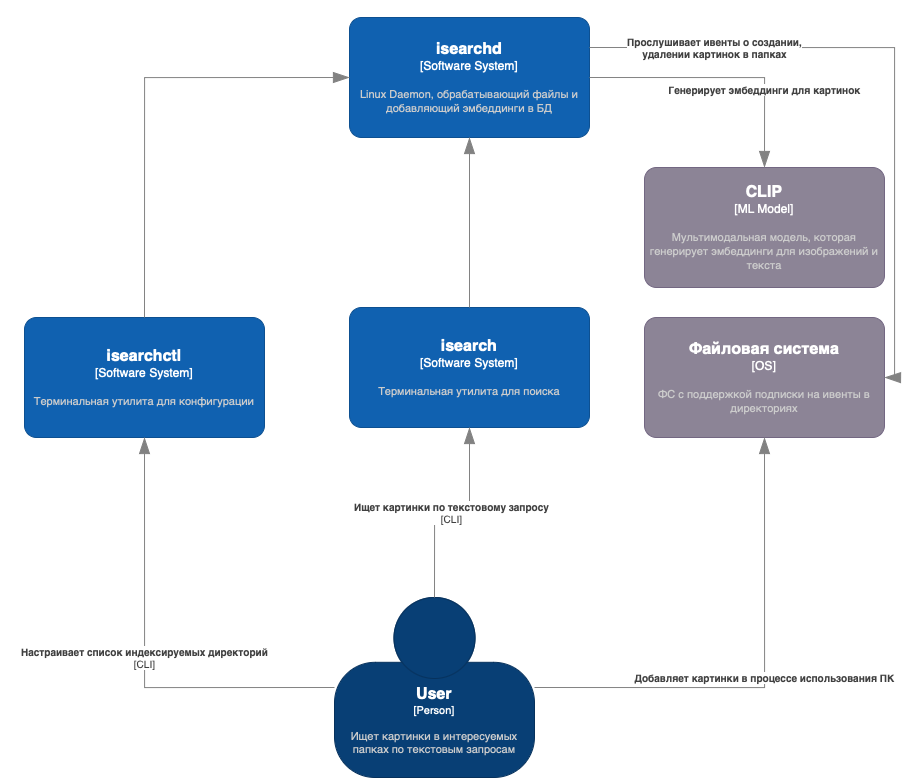
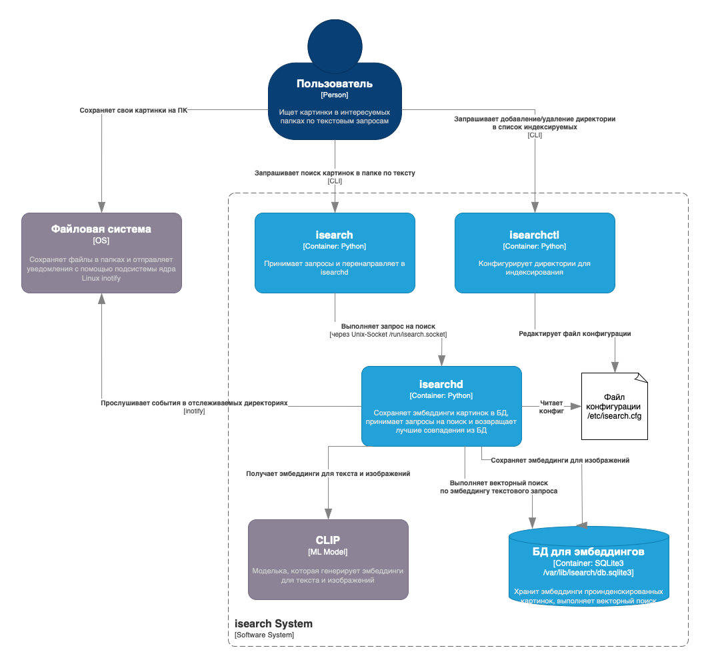

# isearch 

## Общее описание 

Система для семантического поиска по картинкам, сохранённым в папках на ПК пользователя. 

У многих людей есть папка "Изображения" на компьютере, в которой тысячи файлов с бесполезными названиями, по которым невозможно ориентироваться, поэтому при надобности достать нужный файл очень проблематично. 

Поэтому предлагается разработать систему Daemon+CLI, с помощью которой можно будет выполнять быстрый семантический поиск по картинкам в любой из выбранных директорий. 

Пример использования: 
```bash 
$ isearch 'мемы с котиками' 

/Users/roshi/Pictures/pic-full-210626-1542-58.png
/Users/roshi/Pictures/pic-full-210306-2218-27.png
/Users/roshi/Pictures/pic-selected-200611-2059-42.png
/Users/roshi/Pictures/pic-selected-211031-1421-57.png
/Users/roshi/Pictures/Screenshot 2022-06-05 at 08.40.30.png
```

## Реализация 

В качестве модели используется CLIP: эта мультимодальная модель может получать на вход как текст, так и изображения, и возвращать векторные эмбеддинги для них, которые потом можно сравнивать. В этом и заключается суть семантического поиска.  

Крутится демон isearchd, который подписан на события в папках через inotify, при появлении нового файла он генерирует для него эмбеддинг через CLIP и записывает в SQLite вместе с путём к файлу. 

Когда приходит запрос из isearch, для текстового запроса генерируется эмбеддинг через CLIP и затем происходит векторный поиск по самым совпадающим эмбеддингам из БД. 

## Диаграммы 

### Диаграмма C1 


### Диаграмма C2 


[Ссылка на диаграммы](https://drive.google.com/file/d/1ZRCyDkhljztHS2Crj0z7jfxlvnq18PN3/view?usp=sharing)

## Задачи 

- [x] Документация, диаграммы 
- [x] isearch CLI  
- [x] Интеграция isearch и isearchd через Unix-сокет
- [x] isearchd: прослушивание ивентов из inotify 
- [x] isearchd: обёртка для CLIP 
- [x] isearchd: обёртка для бд и поиска 

### Допзадачи 
- [x] isearch: команда --reindex
- [x] isearchctl: realtime отображение прогресса для reindex через сокеты
- [x] isearchd: корректная обработка удаления и изменения файлов
- [ ] isearch: аргумент для кол-ва картинок 
- [ ] isearchctl - добавление нескольких папок для индексирования
- [ ] isearchd: прослушивание нескольких папок 


